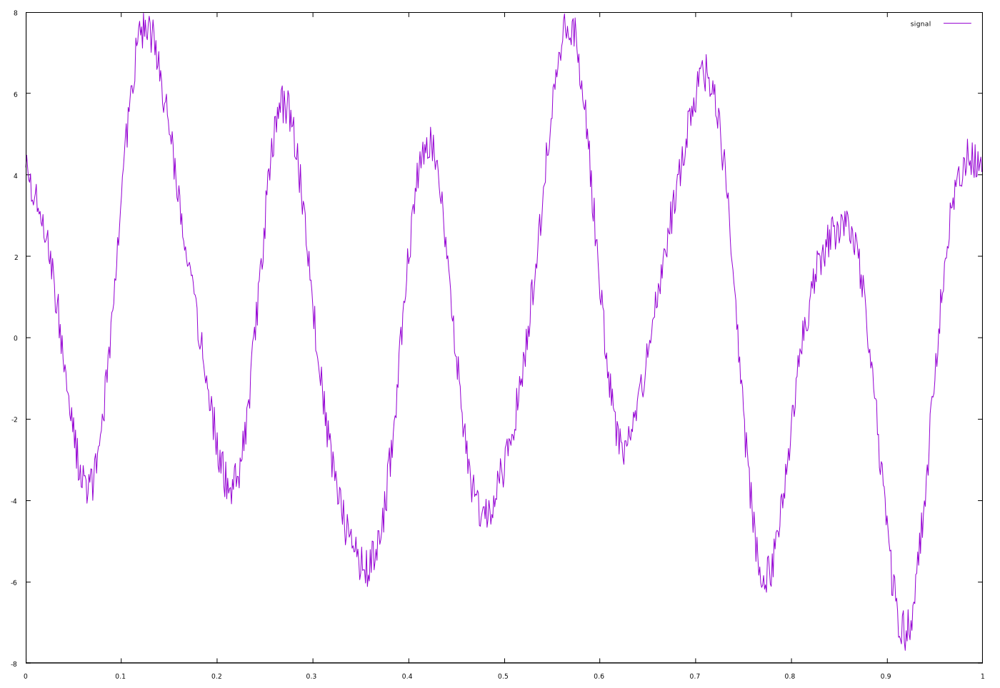

# WaveGen

[](https://app.circleci.com/pipelines/github/HeRCLab/wavegen?branch=master) [](https://goreportcard.com/report/github.com/HeRCLab/wavegen) [](https://pkg.go.dev/github.com/herclab/wavegen)

This tool is used to generate composite waves as test data for one of our
projects. It allows the user to specify a collection of noise levels,
amplitudes, frequencies, and phases, and generates each requested sin wave and
noise, then sums them together for output in a standard format.

## Installation

### From Binary

Download the `.deb` or generic tarball binaries from the GitHub releases page
and install as appropriate.

### From Source

Run `go install ./cmd/wavegen/...`, this will install wavegen into your
`$GOPATH`.

If you would prefer a system-wide installation, run `make ; sudo make install`
(requires `help2man` and `ronn` installed).

### Release

To generate a release:

Pre-requisites:
* Golang version 1.13 or better
* help2man
* ronn
* checkinstall
* gnuplot

On Ubuntu 20.04: `sudo apt install help2man ronn golang-go checkinstall gnuplot`

Run `./build_release.sh`, you must have permission to run commands with `sudo`.
This will generate a generic binary tarball, as well as a Debian binary package
package.

**NOTE**: attempting to compile a release without having `gnuplot` install may
cause `checkinstall` to fail with inscrutable errors.

**NOTE**: it is rare one would want to do this manually, the CI will
automatically generate and upload binaries for tagged releases matching `x.y.z`
format.

## Usage

See `man wavegen`.

`gnuplot` must be installed.

### Example: Basic

Suppose we wished to compose three different signals, to produce an composed
output:

```
$ wavegen generate -d 1 -f 2 -f 7 -f 13 -p 0 -p 2 -p 5 -a 2 -a 5 -a 1 -n pseudo -n none -n none -o noisy.json
$ wavegen summarize -i noisy.json
SYNTHETIC WAVE PARAMETERS SUMMARY:

        Sample Rate . . . . . 1000.000000
        Offset  . . . . . . . 0.000000s
        Duration  . . . . . . 1.000000s
        Global Noise  . . . . none
        |Global Noise|  . . . 0.000000

        COMPONENTS:
                2.000000 × Sin(2 × π × 2.000000 × t + 0.000000) + 1.000000 × pseudo()
                5.000000 × Sin(2 × π × 7.000000 × t + 2.000000)
                1.000000 × Sin(2 × π × 13.000000 × t + 5.000000)

SIGNAL DATA SUMMARY:

        # of Samples . . . . . . 1000
        Reported Sample Rate . . 1000.000000
        Average Sample Rate  . . 1000.000000
        Duration . . . . . . . . 0.999000s
        Mean . . . . . . . . . . 0.488862
        Median . . . . . . . . . 0.611133
        Standard Deviation . . . 3.873371
        Min  . . . . . . . . . . -7.684887
        Max  . . . . . . . . . . 7.974088

        SIGNAL DATA OVERVIEW:

            7.69    ┤       ╭╮                          ╭╮
            7.19    ┤       ││                          ││
            6.69    ┤       ││                         ╭╯│       ╭╮
            6.19    ┤      ╭╯╰╮                        │ │      ╭╯│
            5.69    ┤      │  │      ╭╮                │ │      │ │
            5.19    ┤      │  │      ││                │ ╰╮     │ │
            4.69    ┤      │  │      ││       ╭╮       │  │     │ ╰╮              ╭╮
            4.18    ┼╮     │  │     ╭╯╰╮      │╰╮      │  │    ╭╯  │              │╰
            3.68    ┤│     │  ╰╮    │  │      │ │      │  │    │   │              │
            3.18    ┤╰╮    │   │    │  │      │ │     ╭╯  │    │   │      ╭╮     ╭╯
            2.68    ┤ │    │   │    │  │      │ │     │   │    │   │     ╭╯│     │
            2.18    ┤ │   ╭╯   │    │  │      │ │     │   │   ╭╯   │     │ │     │
            1.68    ┤ │   │    ╰╮   │  │      │ │     │   │   │    │    ╭╯ ╰╮    │
            1.18    ┤ │   │     │   │  │     ╭╯ ╰╮    │   ╰╮  │    │    │   │    │
            0.68    ┤ ╰╮  │     │   │  ╰╮    │   │    │    │  │    │    │   │    │
            0.18    ┼  │  │     │  ╭╯   │    │   │   ╭╯    │  │    │    │   │    │
           -0.32    ┤  │  │     │  │    │    │   │   │     │ ╭╯    ╰╮  ╭╯   │   ╭╯
           -0.83    ┤  │  │     │  │    │    │   │   │     │ │      │  │    │   │
           -1.33    ┤  │  │     ╰╮ │    │    │   │   │     │ │      │  │    ╰╮  │
           -1.83    ┤  ╰╮╭╯      │ │    │    │   │   │     ╰─╯      │  │     │  │
           -2.33    ┤   ││       │ │    ╰╮   │   ╰╮ ╭╯              │  │     │  │
           -2.83    ┤   ││       ╰╮│     │  ╭╯    │ │               │  │     │  │
           -3.33    ┤   ╰╯        ╰╯     │  │     │ │               │  │     │  │
           -3.83    ┤                    │  │     │╭╯               │ ╭╯     │  │
           -4.33    ┤                    ╰╮ │     ╰╯                ╰╮│      │ ╭╯
           -4.83    ┤                     │ │                        ││      ╰╮│
           -5.34    ┤                     │╭╯                        ╰╯       ││
           -5.84    ┤                     ╰╯                                  ││
           -6.34    ┤                                                         ││
           -6.84    ┤                                                         ││
           -7.34    ┤                                                         ╰╯
$ wavegen view -i noisy.json
```



### Example: Adding Signal Components

The parameters component of a previously saved JSON file can be augmented by
passing it as input to the `-l` flag of `wavegen generate`. Lets suppose we
wanted to augment the `noisy.json` file from the previous example by changing
the duration to 2 seconds and adding a new signal component...

**NOTE**: when using `wavegen generate` in this fashion, only the `parameters`
field of the JSON file is used, the data is fully re-generated from scratch
with the new set of parameters.

```
$ wavegen generate -d 2 -f 23 -p 7 -a 1.5 -l noisy.json -o augmented.json
$ wavegen summarize -i augmented.json
SYNTHETIC WAVE PARAMETERS SUMMARY:

        Sample Rate . . . . . 1000.000000
        Offset  . . . . . . . 0.000000s
        Duration  . . . . . . 2.000000s
        Global Noise  . . . . none
        |Global Noise|  . . . 0.000000

        COMPONENTS:
                1.500000 × Sin(2 × π × 23.000000 × t + 7.000000) + 1.000000 × pseudo()
                2.000000 × Sin(2 × π × 2.000000 × t + 2.000000)
                7.000000 × Sin(2 × π × 7.000000 × t + 7.000000)
                13.000000 × Sin(2 × π × 13.000000 × t + 13.000000)

SIGNAL DATA SUMMARY:

        # of Samples . . . . . . 2000
        Reported Sample Rate . . 1000.000000
        Average Sample Rate  . . 1000.000000
        Duration . . . . . . . . 1.999000s
        Mean . . . . . . . . . . 0.494718
        Median . . . . . . . . . 0.504328
        Standard Deviation . . . 10.589475
        Min  . . . . . . . . . . -21.229516
        Max  . . . . . . . . . . 22.886851

        SIGNAL DATA OVERVIEW:

           21.90     ┤                               ╭╮
           20.50     ┤                               ││
           19.09     ┤         ╭╮                    ││
           17.68     ┤         ││   ╭╮               ││   ╭╮
           16.28     ┤         ││   ││          ╭╮   ││   ││                    ╭╮
           14.87     ┤         ││   ││          ││   ││   ││                    ││
           13.46     ┼╮   ╭╮   ││   ││          ││   ││   ││                    ││
           12.06     ┤│   ││   ││   ││          ││   ││   ││          ╭╮   ╭╮   ││  ╭
           10.65     ┤│   ││   ││   ││          ││   ││   ││     ╭╮╭╮ ││╭╮ ││   ││  │
            9.25     ┤│   ││   ││   ││     ╭╮   ││   ││   ││   ╭╮││││ ││││ ││   ││  │
            7.84     ┤╰╮  ││   ││   ││     ││   ││   ││   ││   ││││││ ││││ ││   ││╭╮│
            6.43     ┤ │╭╮││   ││ ╭╮││ ╭╮╭╮││   ││   ││   ││   ││││││ ││││ ││╭╮ │││││
            5.03     ┤ │││││   ││ ││││ ││││││   ││   ││   ││  ╭╯│││││ ││││ ││││ │││││
            3.62     ┤ │││││ ╭╮││ ││││ ││││││   ││╭╮ ││   ││  │ ││││╰╮││││ ││││ │││││
            2.22     ┼ │││││ ││││ ││││╭╯│││││ ╭╮││││ ││   ││  │ ││││ │││││ ││││ │││││
            0.81     ┤ │││││ ││││ │││││ │││││ ││││││ ││╭╮ ││╭╮│ ││││ │││││ ││││ │││││
           -0.60     ┤ │││││ ││││ │╰╯││ ││││╰╮│││││╰╮││││ │││││ ││││ │││││ ││││╭╯││││
           -2.00     ┤ │││││ ││││ │  ││ ╰╯││ ││││╰╯ │││││╭╯││││ ││││ │││││ │││││ ││││
           -3.41     ┤ ││││╰╮││││ │  ││   ││ ╰╯││   ││││││ ││││ ││╰╯ │││││ │││││ ││││
           -4.81     ┤ ││││ │││││ │  ││   ││   ││   ││││││ ││││ ││   │││││ │││││ ││││
           -6.22     ┤ ││││ │││││╭╯  ││   ││   ││   ││││││ ││╰╯ ││   ││╰╯│ │││││ ││││
           -7.63     ┤ ││││ ││││││   ││   ││   ││   ││╰╯╰╯ ││   ││   ││  ╰╮│╰╯││ ││││
           -9.03     ┤ ││││ ││││╰╯   ││   ││   ││   ╰╯     ││   ││   ││   ││  ││ ╰╯││
          -10.44     ┤ ╰╯││ ╰╯││     ││   ││   ││          ││   ││   ││   ││  ││   ││
          -11.85     ┤   ││   ╰╯     ││   ││   ││          ││   ││   ││   ││  ││   ╰╯
          -13.25     ┤   ╰╯          ││   ││   ││          ││   ││   ╰╯   ╰╯  ││
          -14.66     ┤               ││   ││   ││          ││   ││            ││
          -16.06     ┤               ││   ││   ╰╯          ││   ││            ╰╯
          -17.47     ┤               ╰╯   ││               ││   ╰╯
          -18.88     ┤                    ││               ╰╯
          -20.28     ┤
```


## License

[LICENSE](./LICENSE)

